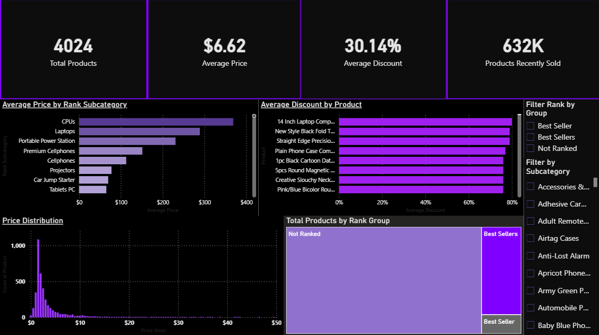

## SHEIN Electronics Data Analysis & Dashboard
# Project Overview

This project analyzes a dataset of SHEIN electronics products. The goal was to:

- Clean and preprocess the raw data using Python (pandas in Jupyter).
- Visualize and analyze the data using Power BI.
- Build an interactive dashboard to explore pricing, discounts, rankings, and sales performance.

This is a full end-to-end data project — from raw messy data to clean dataset to insights dashboard.

# Data Cleaning (Jupyter Notebook)

The raw dataset (us-shein-electronics-4395.csv) contained missing values, inconsistent formats, and text-based metrics. Key cleaning steps:

- Removed rows with missing product_title.
- Dropped mostly-empty columns (goods-title-link--jump)
- Normalized product_title text and removed duplicates
- Parsed ranking columns:

  - rank_number: extracted numbers, default "Not Applicable".
  - rank_group: "Best Seller" or "Not Ranked".
  - rank_subcategory: default "Uncategorized".

- Cleaned pricing data:
  - Converted price to float.
  - Converted discount_percent to integer percent (default 0).
- Cleaned sales data:

  - Extracted numeric values from selling_proposition (e.g., "1.2k sold recently" -> 1200).
  - Default = 0 if no sales data.
  - Converted color-count to integer (default 1).
  - Output: cleaned_us-shein-electronics.csv (4,029 products, fully structured).

# Dashboard (Power BI)

An interactive dashboard was built to visualize product insights.
KPI Band (Top Row):
  - Total Products = 4,024
  - Average Price = $6.62
  - Average Discount % = 30%
  - Products Recently Sold = 632K
Core Visuals (Middle Row):
  - Bar Chart: Average Price by Subcategory
  - Column Chart: Top 10 Products by Discount %
  
Distribution Insights (Bottom Row):
  - Histogram: Price Distribution (filtered to prices <= $50 for clarity)
  - Treemap: Product Count by Rank Group
  - Filters (Side Panel):
  - Rank Group (dropdown filter)
  - Rank Subcategory (multi-select filter)

# Key Insights
- 75% of products are priced below $5.
- Over half of products have 0% discount; maximum discount is 80%.
- Most products are "Not Ranked," with only about 16% tagged as "Best Sellers."
- Top-selling products sold in the thousands, but many have 0 sales recorded.

# Project Structure:
├── data/
│   └── cleaned_us-shein-electronics.csv
├── notebooks/
│   └── shein_cleaning.ipynb
├── dashboard/
│   └── shein_dashboard.pbix
├── images/
│   └── dashboard_screenshot.png
└── README.md

# How to Use:
Clone this repository.
Open shein_cleaning.ipynb and run the cleaning pipeline in Jupyter.
Open shein_dashboard.pbix in Power BI to interact with the dashboard.

# Tech Stack:
- Python (pandas, matplotlib) for data cleaning and preprocessing.
- Power BI for interactive visualization and dashboard design.

Author

Project by Yusuf Kamal — aspiring Data Analyst.
